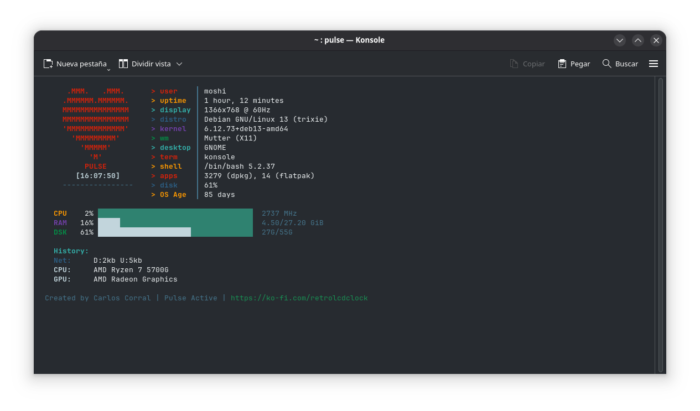

# Pulse - System Monitor v1.4



Real-time monitoring of CPU, RAM, disk, network, and temperatures in your terminal.

## Installation

To install Pulse v1.4, follow these steps:

### 1. Copy the script to your bin folder
```bash
cp pulse ~/.local/bin/
chmod +x ~/.local/bin/pulse
```

### 2. Copy the desktop file to applications folder
```bash
cp pulse.desktop ~/.local/share/applications/
```

### 3. Copy the icon to icons folder
```bash
cp pulse.svg ~/.local/share/icons/
```

### 4. Add to PATH if needed
```bash
echo 'export PATH="$HOME/.local/bin:$PATH"' >> ~/.bashrc
source ~/.bashrc
```

### 5. Test installation
```bash
pulse --version
```

Or system-wide installation:
```bash
sudo cp pulse /usr/local/bin/
sudo chmod +x /usr/local/bin/pulse
sudo cp pulse.desktop /usr/share/applications/
sudo cp pulse.svg /usr/share/icons/
```

## Usage

```bash
pulse              # Start monitoring
pulse --quiet      # Single-line mode
pulse -i 2         # Refresh every 2 seconds
```

## Options

- `-h, --help` - Show help
- `-v, --version` - Show version  
- `-i, --interval N` - Refresh interval (seconds)
- `-q, --quiet` - Single-line output

## Environment

```bash
DISK_PATH=/home pulse    # Monitor /home instead of /
WM=i3 pulse              # Override window manager
```

## Requirements

- Bash 4.0+
- Linux system
- Optional: `lm-sensors` (temperatures), `nvidia-utils` (GPU), `upower` (battery)

## License

MIT - See LICENSE.md
